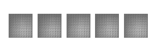

# DChairGAN :chair: :brain:

This is an educational project for the seminar "Cybersecuruty and AI" at the FU Berlin. The aim is to implement a DCGAN
and show the results in this README file.

- [DChairGAN :chair: :brain:](#dchairgan-chair-brain)
  - [Overview :eye:](#overview-eye)
  - [Implementation :computer:](#implementation-computer)
    - [Training Monitoring](#training-monitoring)
  - [Results :receipt: :chart:](#results-receipt-chart)
  - [Discussion :speech_balloon:](#discussion-speech_balloon)
  - [Presentation 📎](#presentation-)
## Overview :eye:

GANs are generative adversarial networks consisting of a discriminator and a generator network. This architecture was first
published by [Ian Goodfellow *et al* in 2014]( https://proceedings.neurips.cc/paper/2014/file/5ca3e9b122f61f8f06494c97b1afccf3-Paper.pdf). Here I implement a [deep convolutional GAN (dcGAN)](https://arxiv.org/pdf/1511.06434.pdf) which is supposed to be more stable in training and better suited for generating images.
## Implementation :computer:
The DChairGAN is implemented using the [tensorflow library](https://www.tensorflow.org) and is build along this
[tutorial by tensorflow](https://www.tensorflow.org/tutorials/generative/dcgan). The MNIST dataset has been replaced with a
set of pictures of chaires taken from [kaggle](https://www.kaggle.com/arminajdehnia/antic-chairs). The pictures are converted to greyscale to reduce the complexity of the task and the size of the networks. The pictures have a different
dimension and thus the input dimension(Discriminator) and output dimension (Generator) had to be adapted accordingly. The original size of the data `100px x 100px` was scaled down to `80px x 80px` so that more upsampling steps could be done (10,20,40,80 instead of 25,50,100). Both networks were made deeper, adding more `conv2D` and `conv2DTranspose` layers. Different depth and sizes of layers were tested but did not yield better results. In addition the learning rate was varied to balance out the training progress of both networks.
### Training Monitoring
To be able to monitor the training in real time, the development of the loss of both networks was evaluated. This was realized using simple `tf.print(loss)` statements. A tensorboard or similar evaluation tools were not used. 
The main issue was that the discriminator quickly minimized its loss while the generator loss increased slowly. This made it impossible for the generator to improve further. 
To fix this, the learning rate of the discriminator was decreased and its complexity was raised.
## Results :receipt: :chart:
The results are presented in a GIF showing the development of the generated images over time. Unfortunately, no results could be optained 
that showed chairs in any way.

Learningrate for both networks 0.0002.

Learningrate for the Generator 0.0008 annd for the discriminator 0.00005

Learningrate for the Generator 0.0002 annd for the discriminator 0.001

## Discussion :speech_balloon:
GANs are hard to train, especially the vanilla GANs published by [Ian Goodfellow *et al* in 2014]( https://proceedings.neurips.cc/paper/2014/file/5ca3e9b122f61f8f06494c97b1afccf3-Paper.pdf). In order to overcome the training issues, I searched the internet and tried to diagnose the problems my networks had using mainly this [article](https://machinelearningmastery.com/how-to-train-stable-generative-adversarial-networks/). During the training the generator loss quickly increased while the discriminator loss decreased and ended up close to zero. Keeping the training progress of the generator and discriminator balanced is crucial. If the generator learns much faster it can fool the discriminator with non realistic images. If the discriminator gets too good too quick the generator has no chance of learning properly. Since in this case, the discriminator loss was close to zero after less than 20 epochs, the second scenario is more likely.
The overall dataset has only 1400 pictures. This can be another cause for the failed training since GANs need lots of data [(50-100k images)](https://blogs.nvidia.com/blog/2020/12/07/neurips-research-limited-data-gan/)
Furthermore, the DChairGAN was trained on an Macbook Air m1. There is no stable implementation of tensorflow or Pytorch
that uses the GPU of the m1 chip. So the training had to be done on the CPU only and thus was not very fast. 
## Presentation 📎
The slides to the presentation can be found [here](GANS_pres.pdf)

